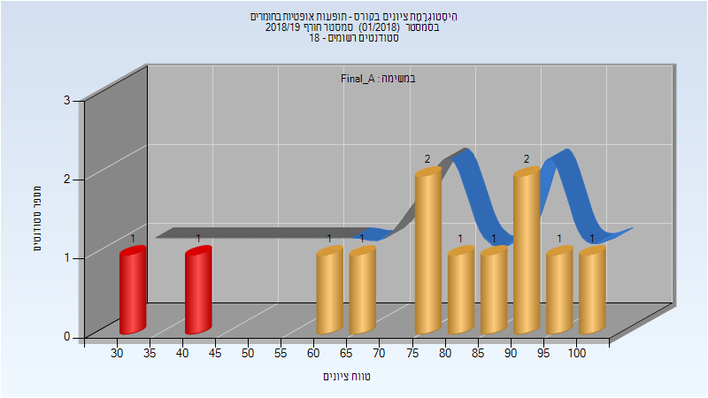
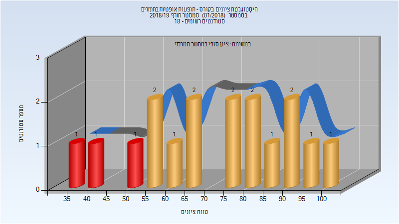

# 315041 - תופעות אופטיות בחומרים

## חורף 2018-2019

| איש סגל | תפקיד |
| ---- | ---- |
| פריי גיטי | מרצה - אחראי מקצוע |
| לויצקי ארטיום | מתרגל - עם הרשאות מרצה אחראי |

### סופי מועד א'

| סטודנטים | עברו/נכשלו | אחוז עוברים | ציון מינימלי | ציון מקסימלי | ממוצע | חציון |
| ---- | ---- | ---- | ---- | ---- | ---- | ---- |
| 12 | 10/2 | 83 | 34 | 100 | 75.917 | 79.5 |

### סופי

| סטודנטים | עברו/נכשלו | אחוז עוברים | ציון מינימלי | ציון מקסימלי | ממוצע | חציון |
| ---- | ---- | ---- | ---- | ---- | ---- | ---- |
| 17 | 14/3 | 82 | 38 | 100 | 72 | 75 |

## חורף 2019-2020

| איש סגל | תפקיד |
| ---- | ---- |
| פריי גיטי | מרצה - אחראי מקצוע |
| לויצקי ארטיום | מתרגל - עם הרשאות מרצה אחראי |
| דוד רותי | סגל מנהלי - עם הרשאות מרצה אחראי |
| סנדר אושרית | סגל מנהלי - עם הרשאות מרצה אחראי |

## חורף 2020-2021

| איש סגל | תפקיד |
| ---- | ---- |
| סנדר אושרית | סגל מנהלי - עם הרשאות מרצה אחראי |
| דוד רותי | סגל מנהלי - עם הרשאות מרצה אחראי |

