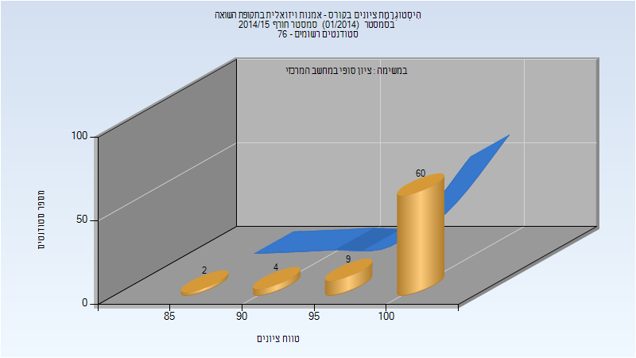

# 324221 - אמנות ויזואלית בתקופת השואה

## חורף 2014-2015

| איש סגל | תפקיד |
| ---- | ---- |
| רוזנברג פנינה | מרצה - אחראי מקצוע |

### סופי

| סטודנטים | עברו/נכשלו | אחוז עוברים | ציון מינימלי | ציון מקסימלי | ממוצע | חציון |
| ---- | ---- | ---- | ---- | ---- | ---- | ---- |
| 75 | 75/0 | 100 | 85 | 100 | 98.467 | 100 |

