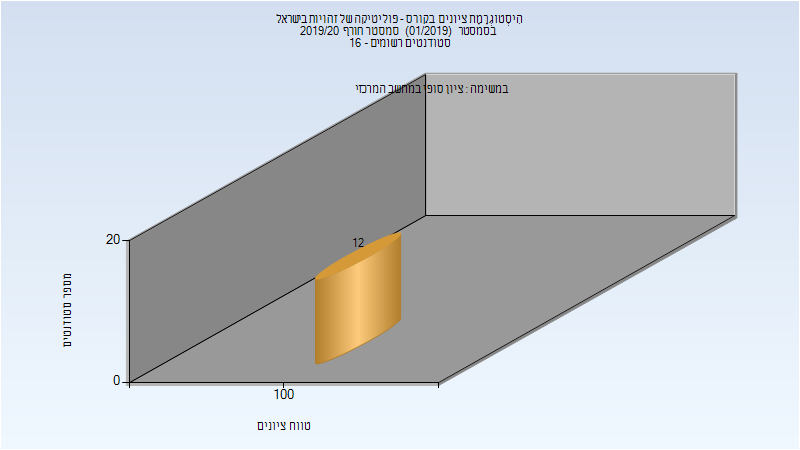

# 324282 - פוליטיקה של זהויות בישראל

## חורף 2019-2020

| איש סגל | תפקיד |
| ---- | ---- |
| פרידמן עירית | מרצה - אחראי מקצוע |
| אלמוגי בת-אל | מרצה |

### סופי מועד א'

| סטודנטים | עברו/נכשלו | אחוז עוברים | ציון מינימלי | ציון מקסימלי | ממוצע | חציון |
| ---- | ---- | ---- | ---- | ---- | ---- | ---- |
| 12 | 12/0 | 100 | 100 | 100 | 100 | 100 |

### סופי

| סטודנטים | עברו/נכשלו | אחוז עוברים | ציון מינימלי | ציון מקסימלי | ממוצע | חציון |
| ---- | ---- | ---- | ---- | ---- | ---- | ---- |
| 12 | 12/0 | 100 | 100 | 100 | 100 | 100 |

