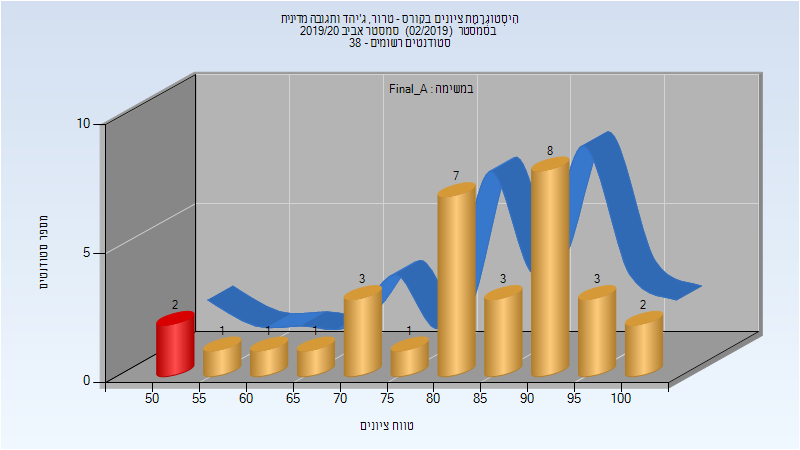
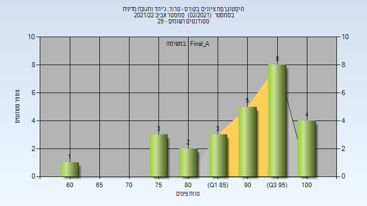

# 324299 - טרור, ג'יהד ותגובה מדינית

## אביב 2020

| איש סגל | תפקיד |
| ---- | ---- |
| נאמן ישראל | מרצה - אחראי מקצוע |
| אלמוגי בת-אל | מרצה |

### סופי מועד א'

| סטודנטים | עברו/נכשלו | אחוז עוברים | ציון מינימלי | ציון מקסימלי | ממוצע | חציון |
| ---- | ---- | ---- | ---- | ---- | ---- | ---- |
| 32 | 30/2 | 94 | 52 | 100 | 82.812 | 85.5 |

## אביב 2022

| איש סגל | תפקיד |
| ---- | ---- |
| נאמן ישראל | מרצה - אחראי מקצוע |

### סופי מועד א'

| סטודנטים | עברו/נכשלו | אחוז עוברים | ציון מינימלי | ציון מקסימלי | ממוצע | חציון |
| ---- | ---- | ---- | ---- | ---- | ---- | ---- |
| 26 | 26/0 | 100 | 60 | 100 | 90.154 | 92 |

