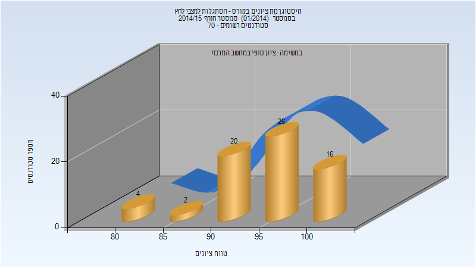

# 324726 - הסתגלות למצבי לחץ

## חורף 2014-2015

| איש סגל | תפקיד |
| ---- | ---- |
| פלד-לינדנש דליה | מרצה - אחראי מקצוע |

### סופי

| סטודנטים | עברו/נכשלו | אחוז עוברים | ציון מינימלי | ציון מקסימלי | ממוצע | חציון |
| ---- | ---- | ---- | ---- | ---- | ---- | ---- |
| 68 | 68/0 | 100 | 82 | 100 | 95.088 | 96 |

