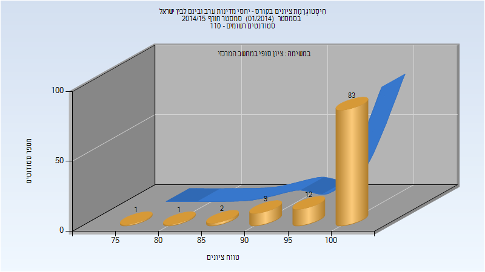

# 324920 - יחסי מדינות ערב ובינם לבין ישראל

## חורף 2014-2015

### סופי

| סטודנטים | עברו/נכשלו | אחוז עוברים | ציון מינימלי | ציון מקסימלי | ממוצע | חציון |
| ---- | ---- | ---- | ---- | ---- | ---- | ---- |
| 108 | 108/0 | 100 | 78 | 100 | 98.537 | 100 |

