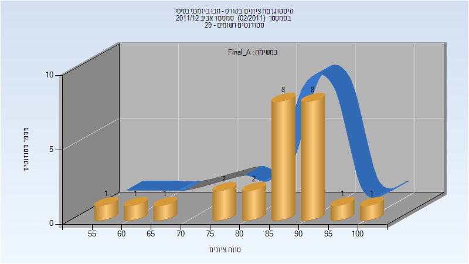

# 334010 - תכן ביומכני בסיסי

## אביב 2012

| איש סגל | תפקיד |
| ---- | ---- |
| ליכטנשטיין אוסקר | מרצה - אחראי מקצוע |

### סופי מועד א'

| סטודנטים | עברו/נכשלו | אחוז עוברים | ציון מינימלי | ציון מקסימלי | ממוצע | חציון |
| ---- | ---- | ---- | ---- | ---- | ---- | ---- |
| 25 | 25/0 | 100 | 57 | 100 | 85.72 | 89 |

