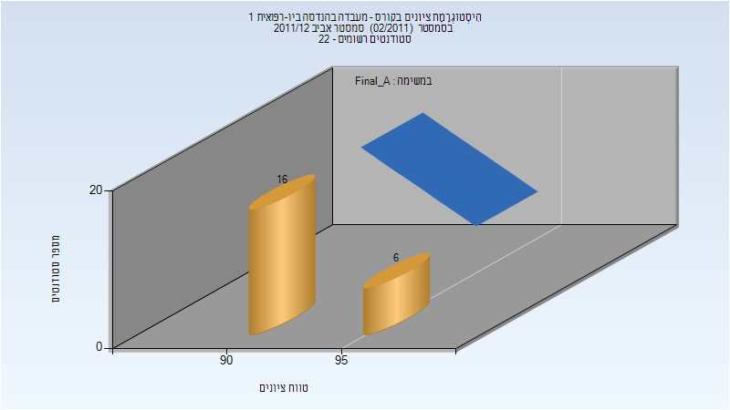

# 334012 - מעבדה בהנדסה ביו-רפואית 1

## אביב 2012

| איש סגל | תפקיד |
| ---- | ---- |
| ליכטנשטיין אוסקר | מרצה - אחראי מקצוע |

### סופי מועד א'

| סטודנטים | עברו/נכשלו | אחוז עוברים | ציון מינימלי | ציון מקסימלי | ממוצע | חציון |
| ---- | ---- | ---- | ---- | ---- | ---- | ---- |
| 22 | 22/0 | 100 | 91 | 97 | 93.682 | 93 |

