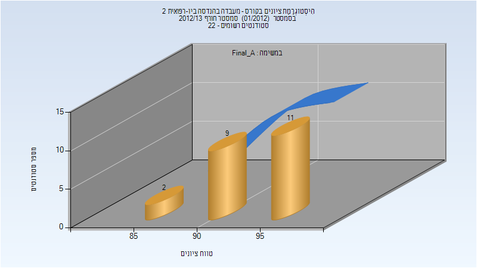

# 334013 - מעבדה בהנדסה ביו-רפואית 2

## חורף 2012-2013

| איש סגל | תפקיד |
| ---- | ---- |
| ליכטנשטיין אוסקר | מרצה - אחראי מקצוע |

### סופי מועד א'

| סטודנטים | עברו/נכשלו | אחוז עוברים | ציון מינימלי | ציון מקסימלי | ממוצע | חציון |
| ---- | ---- | ---- | ---- | ---- | ---- | ---- |
| 22 | 22/0 | 100 | 85 | 97 | 93.864 | 94.5 |

