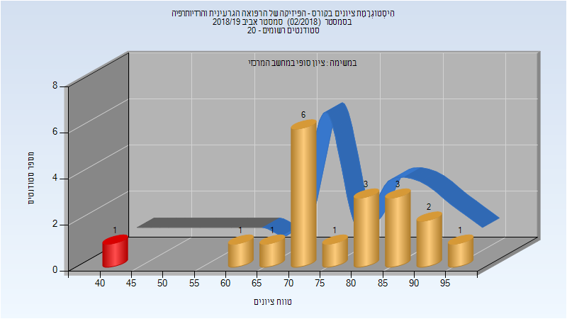

# 336545 - רפואה גרעינית ורדיותרפיה

## אביב 2018

| איש סגל | תפקיד |
| ---- | ---- |
| קנדי ג'ון | מרצה - אחראי מקצוע |
| בר-דרומא רחל | מרצה |

### סופי

| סטודנטים | עברו/נכשלו | אחוז עוברים | ציון מינימלי | ציון מקסימלי | ממוצע | חציון |
| ---- | ---- | ---- | ---- | ---- | ---- | ---- |
| 24 | 23/1 | 96 | 41 | 95 | 79.708 | 82 |

## אביב 2019

### סופי

| סטודנטים | עברו/נכשלו | אחוז עוברים | ציון מינימלי | ציון מקסימלי | ממוצע | חציון |
| ---- | ---- | ---- | ---- | ---- | ---- | ---- |
| 19 | 18/1 | 95 | 42 | 95 | 76.421 | 74 |

