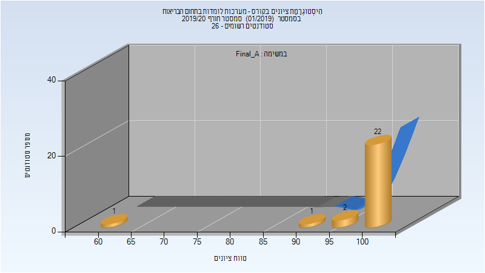
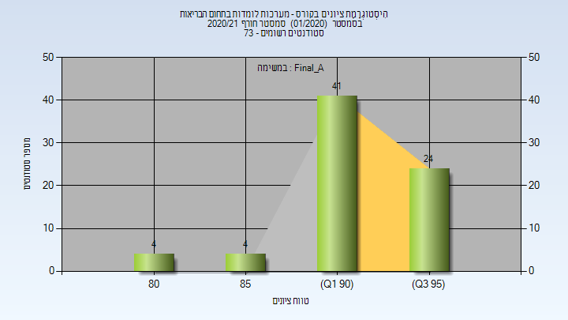
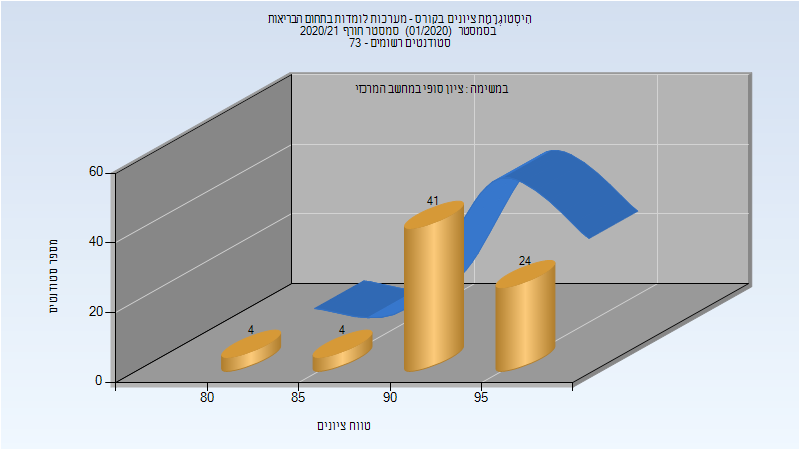

# 336546 - מערכות לומדות בתחום הבריאות

## חורף 2019-2020

| איש סגל | תפקיד |
| ---- | ---- |
| בהר ג'ואקים | מרצה - אחראי מקצוע |
| דוודי מורן | מתרגל - עם הרשאות מרצה אחראי |
| בגין אלון | מתרגל - עם הרשאות מרצה אחראי |

### סופי מועד א'

| סטודנטים | עברו/נכשלו | אחוז עוברים | ציון מינימלי | ציון מקסימלי | ממוצע | חציון |
| ---- | ---- | ---- | ---- | ---- | ---- | ---- |
| 26 | 26/0 | 100 | 60 | 100 | 97.923 | 100 |

### סופי

| סטודנטים | עברו/נכשלו | אחוז עוברים | ציון מינימלי | ציון מקסימלי | ממוצע | חציון |
| ---- | ---- | ---- | ---- | ---- | ---- | ---- |
| 26 | 26/0 | 100 | 60 | 100 | 97.923 | 100 |

## חורף 2020-2021

| איש סגל | תפקיד |
| ---- | ---- |
| בהר ג'ואקים | מרצה - אחראי מקצוע |
| בן ששון יובל | מתרגל - עם הרשאות מרצה אחראי |
| דוודי מורן | מתרגל - עם הרשאות מרצה אחראי |

### סופי מועד א'

| סטודנטים | עברו/נכשלו | אחוז עוברים | ציון מינימלי | ציון מקסימלי | ממוצע | חציון |
| ---- | ---- | ---- | ---- | ---- | ---- | ---- |
| 73 | 73/0 | 100 | 80 | 99 | 92.808 | 93 |

### סופי

| סטודנטים | עברו/נכשלו | אחוז עוברים | ציון מינימלי | ציון מקסימלי | ממוצע | חציון |
| ---- | ---- | ---- | ---- | ---- | ---- | ---- |
| 73 | 73/0 | 100 | 80 | 99 | 92.822 | 93 |

