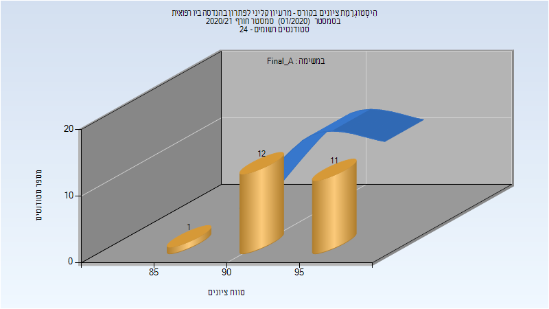

# 338002 - מרעיון קליני לפתרון

## חורף 2020-2021

| איש סגל | תפקיד |
| ---- | ---- |
| בהר ג'ואקים | מרצה - אחראי מקצוע |
| סגל סופיה | מרצה |

### סופי מועד א'

| סטודנטים | עברו/נכשלו | אחוז עוברים | ציון מינימלי | ציון מקסימלי | ממוצע | חציון |
| ---- | ---- | ---- | ---- | ---- | ---- | ---- |
| 24 | 24/0 | 100 | 86 | 99 | 94.208 | 93.5 |

### סופי

| סטודנטים | עברו/נכשלו | אחוז עוברים | ציון מינימלי | ציון מקסימלי | ממוצע | חציון |
| ---- | ---- | ---- | ---- | ---- | ---- | ---- |
| 24 | 24/0 | 100 | 90 | 99 | 95.375 | 95 |

