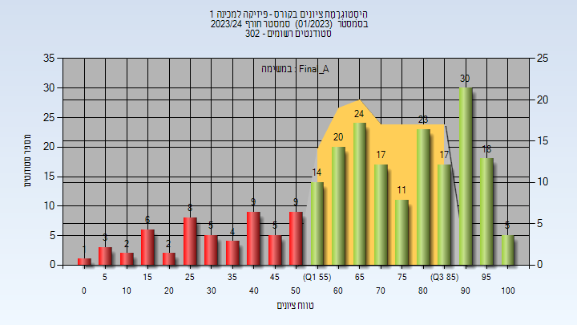
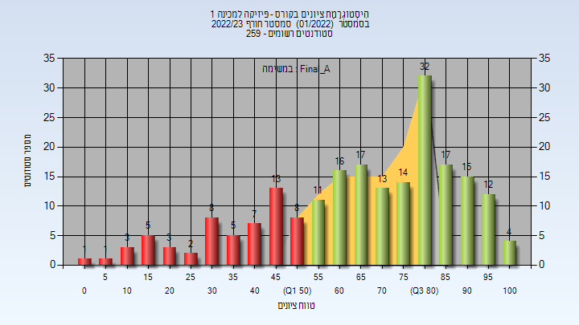
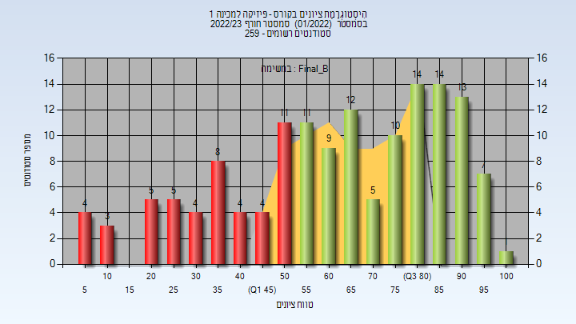
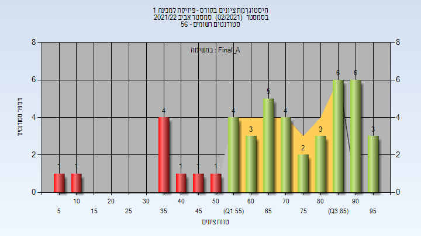
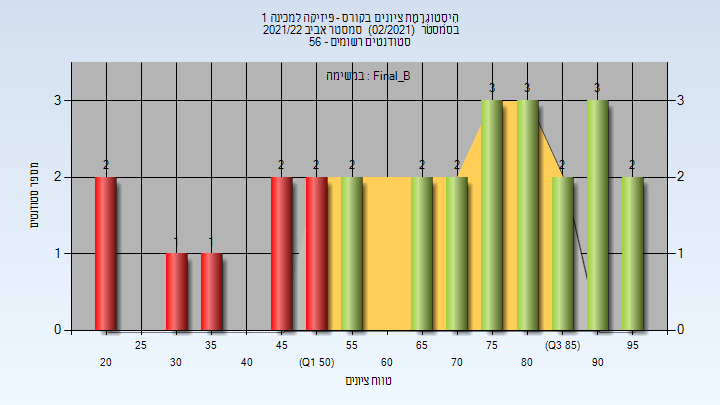
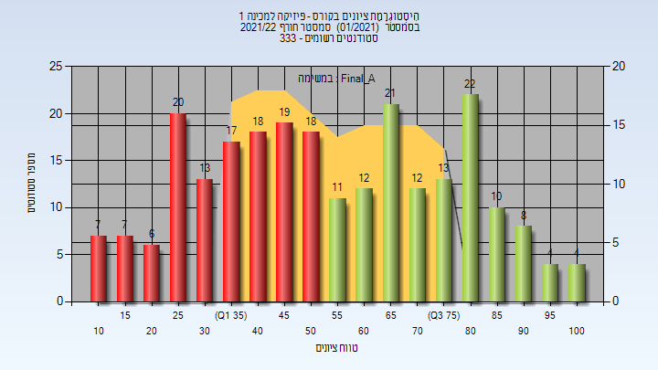
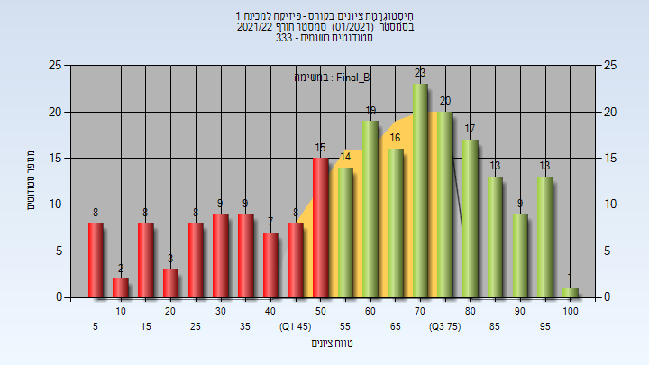
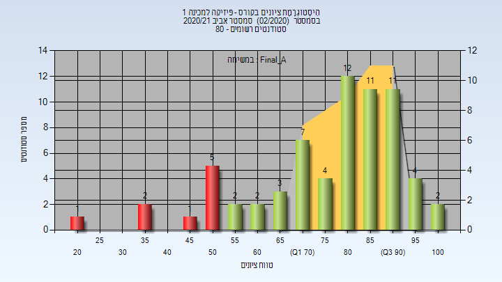
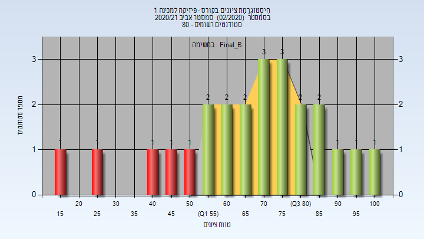
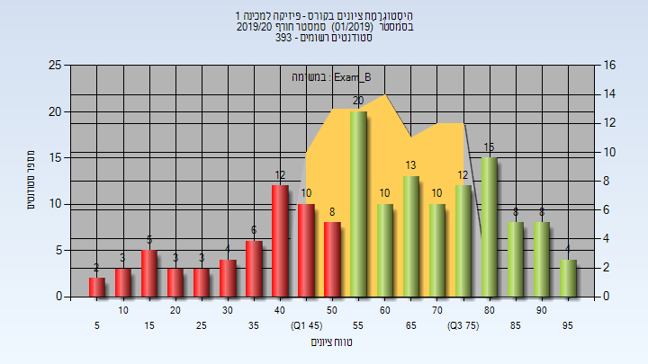

# 97030007 - פיזיקה למכינה 1

**הערה**: מאגר ההיסטוגרמות הוקם עבור [CheeseFork](https://cheesefork.cf/), כלי בניית מערכת שעות עבור סטודנטים בטכניון. באתר בו אתם גולשים ניתן לעיין בהיסטוגרמות, אך הדרך היותר נוחה היא לעיין בהיסטוגרמות, ובמידע נוסף כגון חוות דעת של סטודנטים, באתר CheeseFork.

* [חורף 2023-2024](#202301)
  * [סופי מועד א'](#202301-Final_A)
  * [סופי מועד ב'](#202301-Final_B)
* [חורף 2022-2023](#202201)
  * [סופי מועד א'](#202201-Final_A)
  * [סופי מועד ב'](#202201-Final_B)
* [אביב 2022](#202102)
  * [סופי מועד א'](#202102-Final_A)
  * [סופי מועד ב'](#202102-Final_B)
* [חורף 2021-2022](#202101)
  * [סופי מועד א'](#202101-Final_A)
  * [סופי מועד ב'](#202101-Final_B)
* [אביב 2021](#202002)
  * [סופי מועד א'](#202002-Final_A)
  * [סופי מועד ב'](#202002-Final_B)
* [אביב 2020](#201902)
* [חורף 2019-2020](#201901)
  * [מבחן מועד ב'](#201901-Exam_B)

<h2 id="202301">חורף 2023-2024</h2>

| איש סגל | תפקיד |
| ---- | ---- |
| ראשד פרח | מתרגל |
| שמר רוני | מתרגל |
| נבייב אלברט | מתרגל |
| אאא שירי | סגל מנהלי - עם הרשאות מרצה אחראי |
| אזולאי מיקה | סגל מנהלי - עם הרשאות מרצה אחראי |
| שחל אתי | סגל מנהלי - עם הרשאות מרצה אחראי |

<h3 id="202301-Final_A">סופי מועד א'</h3>

| סטודנטים | עברו/נכשלו | אחוז עוברים | ציון מינימלי | ציון מקסימלי | ממוצע | חציון |
| ---- | ---- | ---- | ---- | ---- | ---- | ---- |
| 233 | 179/54 | 77 | 2 | 100 | 68.18 | 71 |

<h3 id="202301-Final_B">סופי מועד ב'</h3>

| סטודנטים | עברו/נכשלו | אחוז עוברים | ציון מינימלי | ציון מקסימלי | ממוצע | חציון |
| ---- | ---- | ---- | ---- | ---- | ---- | ---- |
| 144 | 113/31 | 78 | 4 | 99 | 70.361 | 76.5 |

<h2 id="202201">חורף 2022-2023</h2>

| איש סגל | תפקיד |
| ---- | ---- |
| שמר רוני | מתרגל |
| אזולאי מיקה | סגל מנהלי - עם הרשאות מרצה אחראי |
| אאא שירי | סגל מנהלי - עם הרשאות מרצה אחראי |
| שחל אתי | סגל מנהלי - עם הרשאות מרצה אחראי |

<h3 id="202201-Final_A">סופי מועד א'</h3>

| סטודנטים | עברו/נכשלו | אחוז עוברים | ציון מינימלי | ציון מקסימלי | ממוצע | חציון |
| ---- | ---- | ---- | ---- | ---- | ---- | ---- |
| 207 | 151/56 | 73 | 2 | 100 | 66.807 | 71 |

<h3 id="202201-Final_B">סופי מועד ב'</h3>

| סטודנטים | עברו/נכשלו | אחוז עוברים | ציון מינימלי | ציון מקסימלי | ממוצע | חציון |
| ---- | ---- | ---- | ---- | ---- | ---- | ---- |
| 144 | 96/48 | 67 | 5 | 100 | 63.174 | 66 |

<h2 id="202102">אביב 2022</h2>

| איש סגל | תפקיד |
| ---- | ---- |
| מיקוליצקי זיו | מתרגל |
| ראשד פרח | מתרגל |
| שמר רוני | מתרגל |
| אאא שירי | סגל מנהלי - עם הרשאות מרצה אחראי |
| שחל אתי | סגל מנהלי - עם הרשאות מרצה אחראי |
| אזולאי מיקה | סגל מנהלי - עם הרשאות מרצה אחראי |

<h3 id="202102-Final_A">סופי מועד א'</h3>

| סטודנטים | עברו/נכשלו | אחוז עוברים | ציון מינימלי | ציון מקסימלי | ממוצע | חציון |
| ---- | ---- | ---- | ---- | ---- | ---- | ---- |
| 45 | 36/9 | 80 | 9 | 98 | 69.2 | 72 |

<h3 id="202102-Final_B">סופי מועד ב'</h3>

| סטודנטים | עברו/נכשלו | אחוז עוברים | ציון מינימלי | ציון מקסימלי | ממוצע | חציון |
| ---- | ---- | ---- | ---- | ---- | ---- | ---- |
| 27 | 19/8 | 70 | 21 | 96 | 67.259 | 71 |

<h2 id="202101">חורף 2021-2022</h2>

| איש סגל | תפקיד |
| ---- | ---- |
| שמר רוני | מתרגל |
| ראשד פרח | מתרגל |
| מיקוליצקי זיו | מתרגל |
| נבייב אלברט | מתרגל |
| אאא שירי | סגל מנהלי - עם הרשאות מרצה אחראי |
| אזולאי מיקה | סגל מנהלי - עם הרשאות מרצה אחראי |
| שחל אתי | סגל מנהלי - עם הרשאות מרצה אחראי |

<h3 id="202101-Final_A">סופי מועד א'</h3>

| סטודנטים | עברו/נכשלו | אחוז עוברים | ציון מינימלי | ציון מקסימלי | ממוצע | חציון |
| ---- | ---- | ---- | ---- | ---- | ---- | ---- |
| 242 | 117/125 | 48 | 11 | 100 | 55.099 | 53.5 |

<h3 id="202101-Final_B">סופי מועד ב'</h3>

| סטודנטים | עברו/נכשלו | אחוז עוברים | ציון מינימלי | ציון מקסימלי | ממוצע | חציון |
| ---- | ---- | ---- | ---- | ---- | ---- | ---- |
| 222 | 145/77 | 65 | 5 | 100 | 60.815 | 65 |

<h2 id="202002">אביב 2021</h2>

| איש סגל | תפקיד |
| ---- | ---- |
| מיקוליצקי זיו | מתרגל |
| נבייב אלברט | מתרגל |
| ראשד פרח | מתרגל |
| שמר רוני | מתרגל |
| אזולאי מיקה | סגל מנהלי - עם הרשאות מרצה אחראי |
| שחל אתי | סגל מנהלי - עם הרשאות מרצה אחראי |
| אאא שירי | סגל מנהלי - עם הרשאות מרצה אחראי |

<h3 id="202002-Final_A">סופי מועד א'</h3>

| סטודנטים | עברו/נכשלו | אחוז עוברים | ציון מינימלי | ציון מקסימלי | ממוצע | חציון |
| ---- | ---- | ---- | ---- | ---- | ---- | ---- |
| 67 | 58/9 | 87 | 24 | 100 | 77.806 | 82 |

<h3 id="202002-Final_B">סופי מועד ב'</h3>

| סטודנטים | עברו/נכשלו | אחוז עוברים | ציון מינימלי | ציון מקסימלי | ממוצע | חציון |
| ---- | ---- | ---- | ---- | ---- | ---- | ---- |
| 24 | 19/5 | 79 | 15 | 100 | 68.5 | 72.5 |

<h2 id="201902">אביב 2020</h2>

| איש סגל | תפקיד |
| ---- | ---- |
| אזולאי מיקה | סגל מנהלי - עם הרשאות מרצה אחראי |
| שחל אתי | סגל מנהלי - עם הרשאות מרצה אחראי |

<h2 id="201901">חורף 2019-2020</h2>

| איש סגל | תפקיד |
| ---- | ---- |
| עמר נטע לי | מרצה |
| רוזנטל רות | מרצה |
| שחל אתי | סגל מנהלי - עם הרשאות מרצה אחראי |

<h3 id="201901-Exam_B">מבחן מועד ב'</h3>

| סטודנטים | עברו/נכשלו | אחוז עוברים | ציון מינימלי | ציון מקסימלי | ממוצע | חציון |
| ---- | ---- | ---- | ---- | ---- | ---- | ---- |
| 156 | 100/56 | 64 | 5 | 99 | 60 | 62 |

