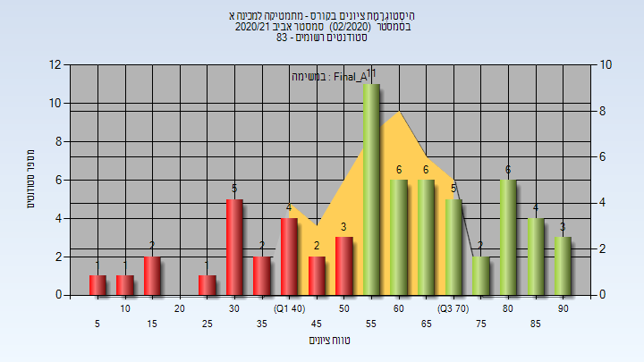
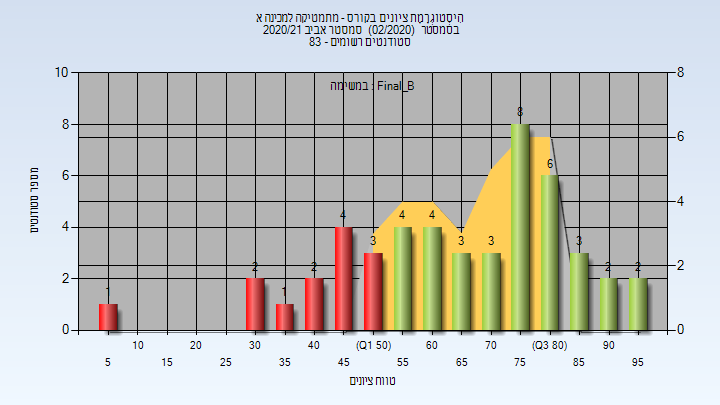
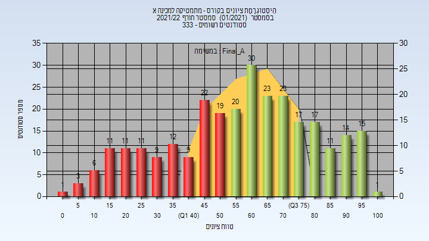
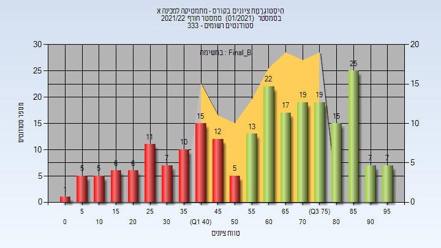
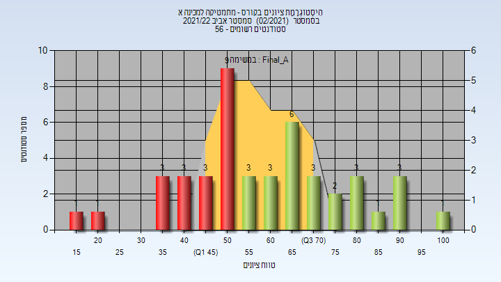
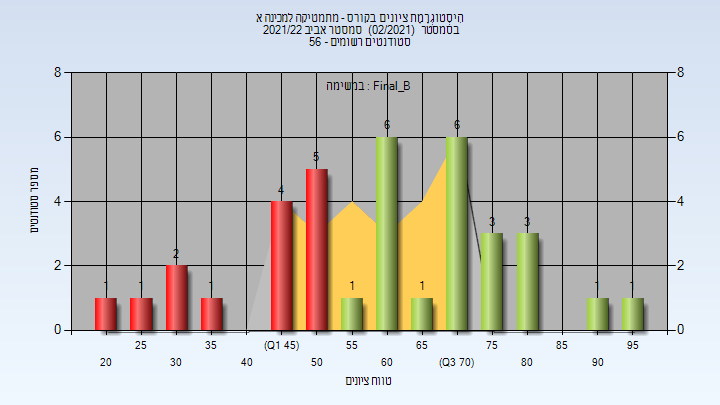
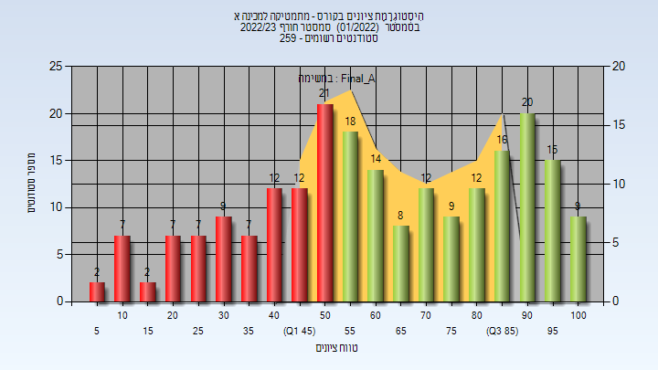
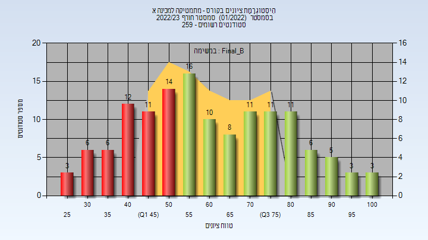
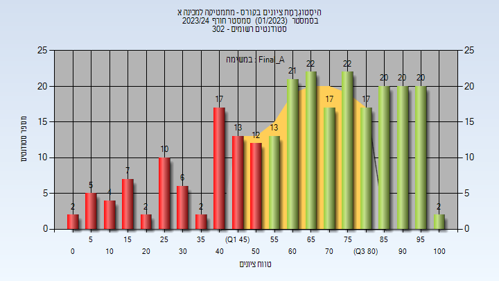
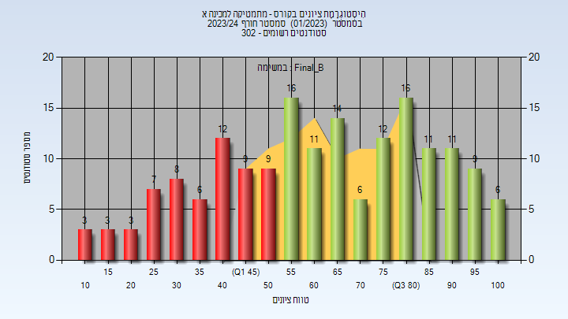

# 973005 - מתמטיקה למכינה א

**הערה**: מאגר ההיסטוגרמות הוקם עבור [CheeseFork](https://cheesefork.cf/), כלי בניית מערכת שעות עבור סטודנטים בטכניון. באתר בו אתם גולשים ניתן לעיין בהיסטוגרמות, אך הדרך היותר נוחה היא לעיין בהיסטוגרמות, ובמידע נוסף כגון חוות דעת של סטודנטים, באתר CheeseFork.

* [חורף 2019-2020](#201901)
* [אביב 2020](#201902)
* [קיץ 2020](#201903)
* [אביב 2021](#202002)
  * [סופי מועד א'](#202002-Final_A)
  * [סופי מועד ב'](#202002-Final_B)
* [חורף 2021-2022](#202101)
  * [סופי מועד א'](#202101-Final_A)
  * [סופי מועד ב'](#202101-Final_B)
* [אביב 2022](#202102)
  * [סופי מועד א'](#202102-Final_A)
  * [סופי מועד ב'](#202102-Final_B)
* [חורף 2022-2023](#202201)
  * [סופי מועד א'](#202201-Final_A)
  * [סופי מועד ב'](#202201-Final_B)
* [חורף 2023-2024](#202301)
  * [סופי מועד א'](#202301-Final_A)
  * [סופי מועד ב'](#202301-Final_B)

<h2 id="201901">חורף 2019-2020</h2>

| איש סגל | תפקיד |
| ---- | ---- |
| שחל אתי | סגל מנהלי - עם הרשאות מרצה אחראי |

<h2 id="201902">אביב 2020</h2>

| איש סגל | תפקיד |
| ---- | ---- |
| אזולאי מיקה | סגל מנהלי - עם הרשאות מרצה אחראי |
| שחל אתי | סגל מנהלי - עם הרשאות מרצה אחראי |

<h2 id="201903">קיץ 2020</h2>

<h2 id="202002">אביב 2021</h2>

| איש סגל | תפקיד |
| ---- | ---- |
| ירושלמי אורן | מתרגל |
| אברהם גרשון | מתרגל |
| מנסור רונית | מתרגל |
| קון בנציון | מתרגל |
| ליטבינוב גלינה | מתרגל |
| לוי מאיר | מתרגל |
| דבשי הדס | מתרגל |
| שחל אתי | סגל מנהלי - עם הרשאות מרצה אחראי |
| אזולאי מיקה | סגל מנהלי - עם הרשאות מרצה אחראי |
| אאא שירי | סגל מנהלי - עם הרשאות מרצה אחראי |

<h3 id="202002-Final_A">סופי מועד א'</h3>

| סטודנטים | עברו/נכשלו | אחוז עוברים | ציון מינימלי | ציון מקסימלי | ממוצע | חציון |
| ---- | ---- | ---- | ---- | ---- | ---- | ---- |
| 64 | 43/21 | 67 | 8 | 94 | 58.984 | 59.5 |

<h3 id="202002-Final_B">סופי מועד ב'</h3>

| סטודנטים | עברו/נכשלו | אחוז עוברים | ציון מינימלי | ציון מקסימלי | ממוצע | חציון |
| ---- | ---- | ---- | ---- | ---- | ---- | ---- |
| 48 | 35/13 | 73 | 7 | 96 | 66.104 | 68.5 |

<h2 id="202101">חורף 2021-2022</h2>

| איש סגל | תפקיד |
| ---- | ---- |
| דבשי הדס | מתרגל |
| אוסטפלד אוסנת | מתרגל |
| אברהם גרשון | מתרגל |
| אאא שירי | סגל מנהלי - עם הרשאות מרצה אחראי |
| אזולאי מיקה | סגל מנהלי - עם הרשאות מרצה אחראי |
| שחל אתי | סגל מנהלי - עם הרשאות מרצה אחראי |

<h3 id="202101-Final_A">סופי מועד א'</h3>

| סטודנטים | עברו/נכשלו | אחוז עוברים | ציון מינימלי | ציון מקסימלי | ממוצע | חציון |
| ---- | ---- | ---- | ---- | ---- | ---- | ---- |
| 285 | 171/114 | 60 | 0 | 100 | 58.649 | 61 |

<h3 id="202101-Final_B">סופי מועד ב'</h3>

| סטודנטים | עברו/נכשלו | אחוז עוברים | ציון מינימלי | ציון מקסימלי | ממוצע | חציון |
| ---- | ---- | ---- | ---- | ---- | ---- | ---- |
| 227 | 144/83 | 63 | 4 | 99 | 59.595 | 64 |

<h2 id="202102">אביב 2022</h2>

| איש סגל | תפקיד |
| ---- | ---- |
| דבשי הדס | מתרגל |
| אוסטפלד אוסנת | מתרגל |
| אזולאי מיקה | סגל מנהלי - עם הרשאות מרצה אחראי |
| שחל אתי | סגל מנהלי - עם הרשאות מרצה אחראי |
| אאא שירי | סגל מנהלי - עם הרשאות מרצה אחראי |

<h3 id="202102-Final_A">סופי מועד א'</h3>

| סטודנטים | עברו/נכשלו | אחוז עוברים | ציון מינימלי | ציון מקסימלי | ממוצע | חציון |
| ---- | ---- | ---- | ---- | ---- | ---- | ---- |
| 45 | 25/20 | 56 | 19 | 100 | 60.489 | 59 |

<h3 id="202102-Final_B">סופי מועד ב'</h3>

| סטודנטים | עברו/נכשלו | אחוז עוברים | ציון מינימלי | ציון מקסימלי | ממוצע | חציון |
| ---- | ---- | ---- | ---- | ---- | ---- | ---- |
| 36 | 22/14 | 61 | 23 | 97 | 61.25 | 63 |

<h2 id="202201">חורף 2022-2023</h2>

| איש סגל | תפקיד |
| ---- | ---- |
| גנאים יסמין | מתרגל |
| אוסטפלד אוסנת | מתרגל |
| אברהם גרשון | מתרגל |
| שחל אתי | סגל מנהלי - עם הרשאות מרצה אחראי |
| אזולאי מיקה | סגל מנהלי - עם הרשאות מרצה אחראי |
| אאא שירי | סגל מנהלי - עם הרשאות מרצה אחראי |

<h3 id="202201-Final_A">סופי מועד א'</h3>

| סטודנטים | עברו/נכשלו | אחוז עוברים | ציון מינימלי | ציון מקסימלי | ממוצע | חציון |
| ---- | ---- | ---- | ---- | ---- | ---- | ---- |
| 219 | 133/86 | 61 | 8 | 100 | 62.621 | 61 |

<h3 id="202201-Final_B">סופי מועד ב'</h3>

| סטודנטים | עברו/נכשלו | אחוז עוברים | ציון מינימלי | ציון מקסימלי | ממוצע | חציון |
| ---- | ---- | ---- | ---- | ---- | ---- | ---- |
| 136 | 84/52 | 62 | 25 | 100 | 62.103 | 60 |

<h2 id="202301">חורף 2023-2024</h2>

| איש סגל | תפקיד |
| ---- | ---- |
| דבשי הדס | מתרגל |
| אברהם גרשון | מתרגל |
| אוסטפלד אוסנת | מתרגל |
| גנאים יסמין | מתרגל |
| אזולאי מיקה | סגל מנהלי - עם הרשאות מרצה אחראי |
| שחל אתי | סגל מנהלי - עם הרשאות מרצה אחראי |
| אאא שירי | סגל מנהלי - עם הרשאות מרצה אחראי |

<h3 id="202301-Final_A">סופי מועד א'</h3>

| סטודנטים | עברו/נכשלו | אחוז עוברים | ציון מינימלי | ציון מקסימלי | ממוצע | חציון |
| ---- | ---- | ---- | ---- | ---- | ---- | ---- |
| 254 | 174/80 | 69 | 3 | 100 | 64.012 | 67 |

<h3 id="202301-Final_B">סופי מועד ב'</h3>

| סטודנטים | עברו/נכשלו | אחוז עוברים | ציון מינימלי | ציון מקסימלי | ממוצע | חציון |
| ---- | ---- | ---- | ---- | ---- | ---- | ---- |
| 172 | 112/60 | 65 | 10 | 100 | 63.035 | 63.5 |

