# 973006 - מתמטיקה למכינה ב

**הערה**: מאגר ההיסטוגרמות הוקם עבור [CheeseFork](https://cheesefork.cf/), כלי בניית מערכת שעות עבור סטודנטים בטכניון. באתר בו אתם גולשים ניתן לעיין בהיסטוגרמות, אך הדרך היותר נוחה היא לעיין בהיסטוגרמות, ובמידע נוסף כגון חוות דעת של סטודנטים, באתר CheeseFork.

* [חורף 2019-2020](#201901)
* [אביב 2021](#202002)
  * [סופי מועד א'](#202002-Final_A)
  * [סופי מועד ב'](#202002-Final_B)
* [חורף 2021-2022](#202101)
  * [סופי מועד א'](#202101-Final_A)
  * [סופי מועד ב'](#202101-Final_B)
* [אביב 2022](#202102)
  * [סופי מועד א'](#202102-Final_A)
  * [סופי מועד ב'](#202102-Final_B)
* [חורף 2022-2023](#202201)
  * [סופי מועד א'](#202201-Final_A)
  * [סופי מועד ב'](#202201-Final_B)
* [אביב 2023](#202202)
  * [סופי מועד א'](#202202-Final_A)
  * [סופי מועד ב'](#202202-Final_B)
* [אביב 2024](#202302)
  * [סופי מועד א'](#202302-Final_A)
  * [סופי מועד ב'](#202302-Final_B)

<h2 id="201901">חורף 2019-2020</h2>

| איש סגל | תפקיד |
| ---- | ---- |
| רוזנטל רות | מרצה |
| עמר נטע לי | מרצה |
| שחל אתי | סגל מנהלי - עם הרשאות מרצה אחראי |

<h2 id="202002">אביב 2021</h2>

| איש סגל | תפקיד |
| ---- | ---- |
| מנסור רונית | מתרגל |
| אברהם גרשון | מתרגל |
| ירושלמי אורן | מתרגל |
| לוי מאיר | מתרגל |
| ליטבינוב גלינה | מתרגל |
| דבשי הדס | מתרגל |
| קון בנציון | מתרגל |
| אאא שירי | סגל מנהלי - עם הרשאות מרצה אחראי |
| אזולאי מיקה | סגל מנהלי - עם הרשאות מרצה אחראי |
| שחל אתי | סגל מנהלי - עם הרשאות מרצה אחראי |

<h3 id="202002-Final_A">סופי מועד א'</h3>

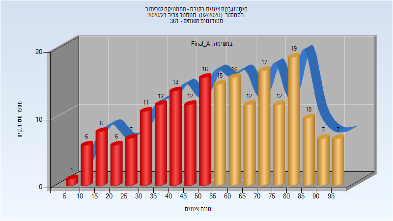

| סטודנטים | עברו/נכשלו | אחוז עוברים | ציון מינימלי | ציון מקסימלי | ממוצע | חציון |
| ---- | ---- | ---- | ---- | ---- | ---- | ---- |
| 208 | 115/93 | 55 | 9 | 99 | 57.236 | 57.5 |

<h3 id="202002-Final_B">סופי מועד ב'</h3>

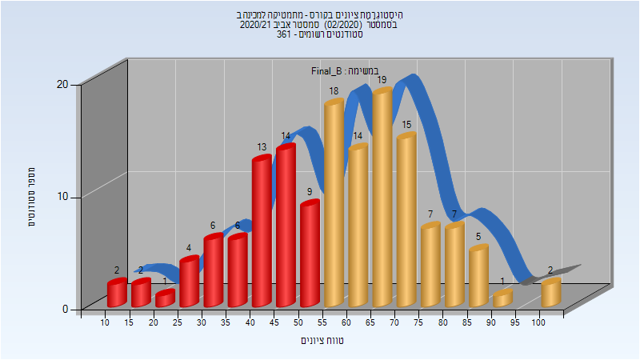

| סטודנטים | עברו/נכשלו | אחוז עוברים | ציון מינימלי | ציון מקסימלי | ממוצע | חציון |
| ---- | ---- | ---- | ---- | ---- | ---- | ---- |
| 145 | 88/57 | 61 | 11 | 100 | 57.745 | 59 |

<h2 id="202101">חורף 2021-2022</h2>

| איש סגל | תפקיד |
| ---- | ---- |
| גנאים יסמין | מתרגל |
| דבשי הדס | מתרגל |
| אברהם גרשון | מתרגל |
| אאא שירי | סגל מנהלי - עם הרשאות מרצה אחראי |
| אזולאי מיקה | סגל מנהלי - עם הרשאות מרצה אחראי |
| שחל אתי | סגל מנהלי - עם הרשאות מרצה אחראי |

<h3 id="202101-Final_A">סופי מועד א'</h3>

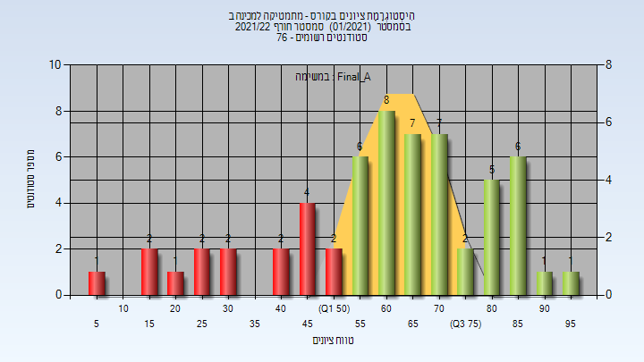

| סטודנטים | עברו/נכשלו | אחוז עוברים | ציון מינימלי | ציון מקסימלי | ממוצע | חציון |
| ---- | ---- | ---- | ---- | ---- | ---- | ---- |
| 59 | 43/16 | 73 | 7 | 99 | 61.627 | 62 |

<h3 id="202101-Final_B">סופי מועד ב'</h3>

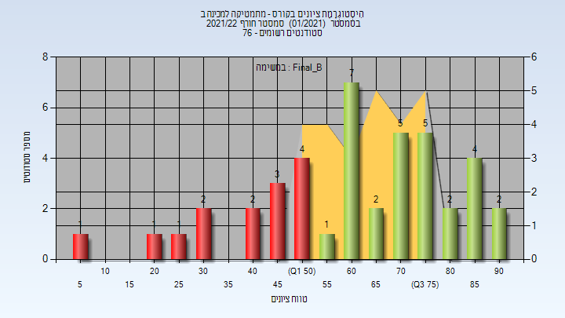

| סטודנטים | עברו/נכשלו | אחוז עוברים | ציון מינימלי | ציון מקסימלי | ממוצע | חציון |
| ---- | ---- | ---- | ---- | ---- | ---- | ---- |
| 42 | 28/14 | 67 | 8 | 91 | 62.619 | 64 |

<h2 id="202102">אביב 2022</h2>

| איש סגל | תפקיד |
| ---- | ---- |
| דבשי הדס | מתרגל |
| אברהם גרשון | מתרגל |
| גנאים יסמין | מתרגל |
| אאא שירי | סגל מנהלי - עם הרשאות מרצה אחראי |
| שחל אתי | סגל מנהלי - עם הרשאות מרצה אחראי |
| אזולאי מיקה | סגל מנהלי - עם הרשאות מרצה אחראי |

<h3 id="202102-Final_A">סופי מועד א'</h3>

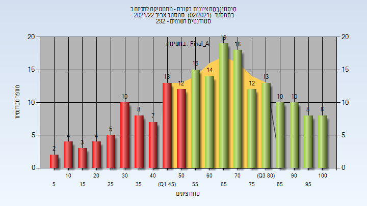

| סטודנטים | עברו/נכשלו | אחוז עוברים | ציון מינימלי | ציון מקסימלי | ממוצע | חציון |
| ---- | ---- | ---- | ---- | ---- | ---- | ---- |
| 195 | 127/68 | 65 | 9 | 100 | 62.282 | 64 |

<h3 id="202102-Final_B">סופי מועד ב'</h3>

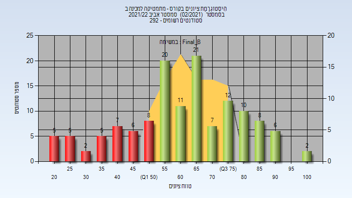

| סטודנטים | עברו/נכשלו | אחוז עוברים | ציון מינימלי | ציון מקסימלי | ממוצע | חציון |
| ---- | ---- | ---- | ---- | ---- | ---- | ---- |
| 135 | 97/38 | 72 | 20 | 100 | 62.311 | 64 |

<h2 id="202201">חורף 2022-2023</h2>

| איש סגל | תפקיד |
| ---- | ---- |
| אברהם גרשון | מתרגל |
| אוסטפלד אוסנת | מתרגל |
| גנאים יסמין | מתרגל |
| אזולאי מיקה | סגל מנהלי - עם הרשאות מרצה אחראי |
| שחל אתי | סגל מנהלי - עם הרשאות מרצה אחראי |
| אאא שירי | סגל מנהלי - עם הרשאות מרצה אחראי |

<h3 id="202201-Final_A">סופי מועד א'</h3>

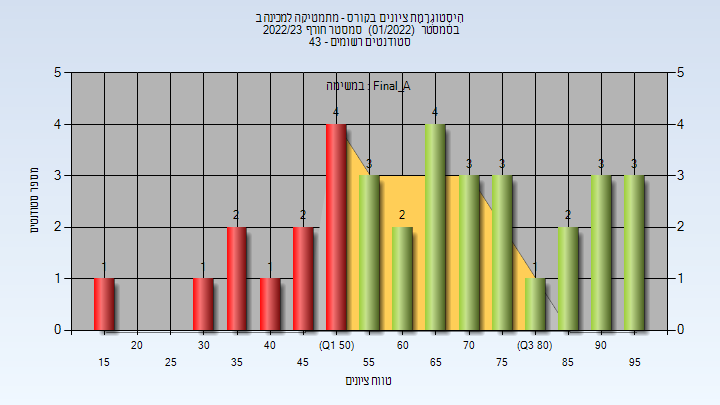

| סטודנטים | עברו/נכשלו | אחוז עוברים | ציון מינימלי | ציון מקסימלי | ממוצע | חציון |
| ---- | ---- | ---- | ---- | ---- | ---- | ---- |
| 35 | 24/11 | 69 | 16 | 97 | 65.8 | 66 |

<h3 id="202201-Final_B">סופי מועד ב'</h3>

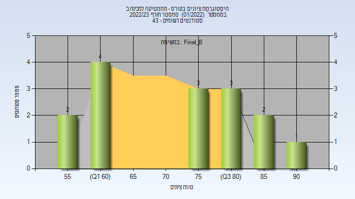

| סטודנטים | עברו/נכשלו | אחוז עוברים | ציון מינימלי | ציון מקסימלי | ממוצע | חציון |
| ---- | ---- | ---- | ---- | ---- | ---- | ---- |
| 15 | 15/0 | 100 | 55 | 90 | 73.133 | 76 |

<h2 id="202202">אביב 2023</h2>

| איש סגל | תפקיד |
| ---- | ---- |
| אוסטפלד אוסנת | מתרגל |
| מצא רועי | מתרגל |
| אברהם גרשון | מתרגל |
| אאא שירי | סגל מנהלי - עם הרשאות מרצה אחראי |
| שחל אתי | סגל מנהלי - עם הרשאות מרצה אחראי |
| אזולאי מיקה | סגל מנהלי - עם הרשאות מרצה אחראי |

<h3 id="202202-Final_A">סופי מועד א'</h3>

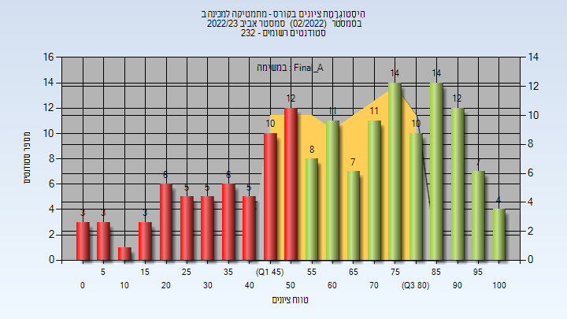

| סטודנטים | עברו/נכשלו | אחוז עוברים | ציון מינימלי | ציון מקסימלי | ממוצע | חציון |
| ---- | ---- | ---- | ---- | ---- | ---- | ---- |
| 157 | 98/59 | 62 | 3 | 100 | 62.185 | 65 |

<h3 id="202202-Final_B">סופי מועד ב'</h3>

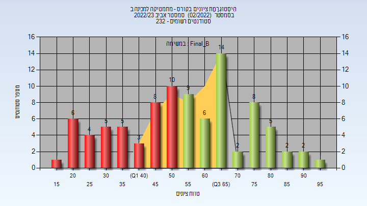

| סטודנטים | עברו/נכשלו | אחוז עוברים | ציון מינימלי | ציון מקסימלי | ממוצע | חציון |
| ---- | ---- | ---- | ---- | ---- | ---- | ---- |
| 91 | 49/42 | 54 | 18 | 97 | 55.901 | 57 |

<h2 id="202302">אביב 2024</h2>

| איש סגל | תפקיד |
| ---- | ---- |
| אברהם גרשון | מתרגל |
| אוסטפלד אוסנת | מתרגל |
| גנאים יסמין | מתרגל |
| דבשי הדס | מתרגל |
| שחל אתי | סגל מנהלי - עם הרשאות מרצה אחראי |
| אזולאי מיקה | סגל מנהלי - עם הרשאות מרצה אחראי |
| אאא שירי | סגל מנהלי - עם הרשאות מרצה אחראי |

<h3 id="202302-Final_A">סופי מועד א'</h3>

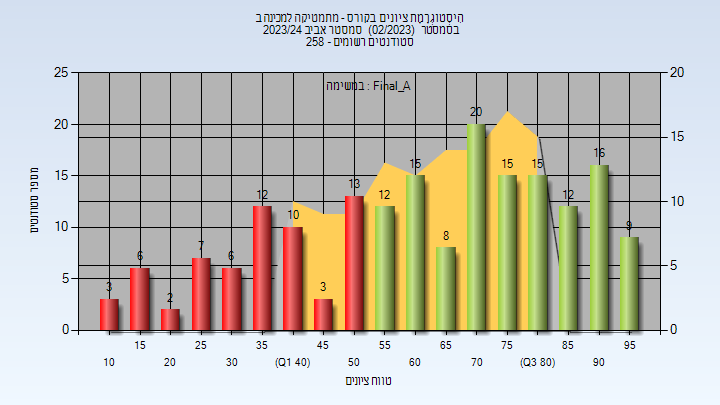

| סטודנטים | עברו/נכשלו | אחוז עוברים | ציון מינימלי | ציון מקסימלי | ממוצע | חציון |
| ---- | ---- | ---- | ---- | ---- | ---- | ---- |
| 184 | 122/62 | 66 | 10 | 99 | 63.19 | 67 |

<h3 id="202302-Final_B">סופי מועד ב'</h3>

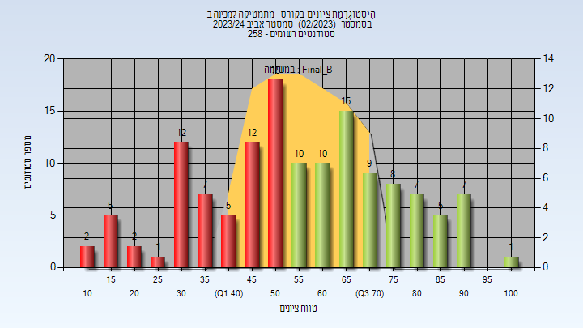

| סטודנטים | עברו/נכשלו | אחוז עוברים | ציון מינימלי | ציון מקסימלי | ממוצע | חציון |
| ---- | ---- | ---- | ---- | ---- | ---- | ---- |
| 136 | 72/64 | 53 | 10 | 100 | 56.765 | 56 |

