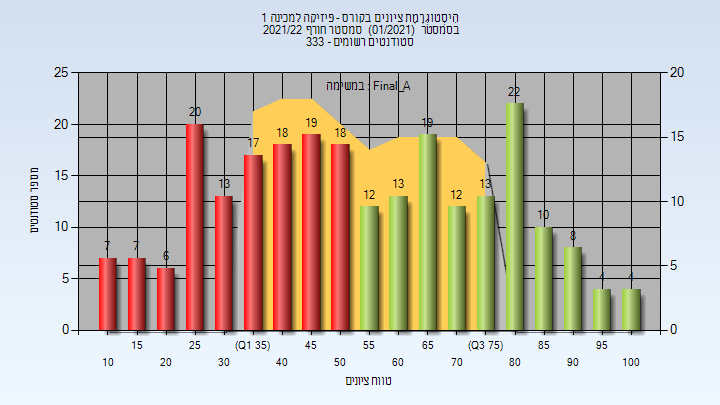
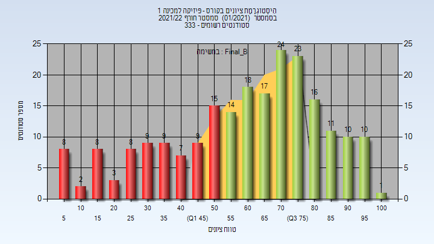

# 973007 - פיזיקה למכינה 1

## חורף 2019-2020

| איש סגל | תפקיד |
| ---- | ---- |
| רוזנטל רות | מרצה |
| עמר נטע לי | מרצה |
| שחל אתי | סגל מנהלי - עם הרשאות מרצה אחראי |

### מבחן מועד ב'

| סטודנטים | עברו/נכשלו | אחוז עוברים | ציון מינימלי | ציון מקסימלי | ממוצע | חציון |
| ---- | ---- | ---- | ---- | ---- | ---- | ---- |
| 156 | 100/56 | 64 | 5 | 99 | 60 | 62 |

## אביב 2020

| איש סגל | תפקיד |
| ---- | ---- |
| שחל אתי | סגל מנהלי - עם הרשאות מרצה אחראי |
| אזולאי מיקה | סגל מנהלי - עם הרשאות מרצה אחראי |

## חורף 2021-2022

| איש סגל | תפקיד |
| ---- | ---- |
| שמר רוני | מתרגל |
| ראשד פרח | מתרגל |
| מיקוליצקי זיו | מתרגל |
| נבייב אלברט | מתרגל |
| שחל אתי | סגל מנהלי - עם הרשאות מרצה אחראי |
| אזולאי מיקה | סגל מנהלי - עם הרשאות מרצה אחראי |

### סופי מועד א'

| סטודנטים | עברו/נכשלו | אחוז עוברים | ציון מינימלי | ציון מקסימלי | ממוצע | חציון |
| ---- | ---- | ---- | ---- | ---- | ---- | ---- |
| 242 | 117/125 | 48 | 11 | 100 | 55.099 | 53.5 |

### סופי מועד ב'

| סטודנטים | עברו/נכשלו | אחוז עוברים | ציון מינימלי | ציון מקסימלי | ממוצע | חציון |
| ---- | ---- | ---- | ---- | ---- | ---- | ---- |
| 222 | 145/77 | 65 | 5 | 100 | 60.811 | 65 |

